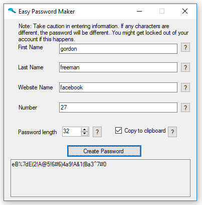
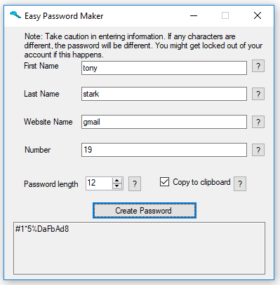
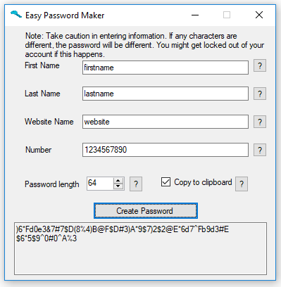

# Easy Password Maker

A standard secure password might look like this
```
HJDw^R2F[s$H/UX/
```
Can you remember that? Probably not.  

Can you remember your first and last name? Hopefully.  
Can you remember a number? Easy.  

Using this program, you can turn your name and a website's name into a secure password. You can also add a number if you ever need to change your password.  

## Examples




